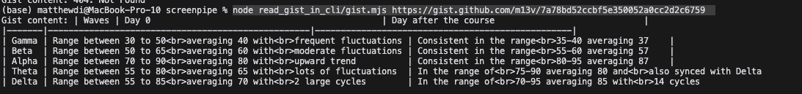

# Get started

0. Clone the repo:

```bash
git clone https://github.com/m13v/read_gist_in_cli.git
```

1. Navigate to the folder where you want the data to be stored
```bash
cd read_gist_in_cli
```

2. Install dependencies:
```bash
npm install
```
3. Run any gist file:
EXAMPLE
```bash
node gist.mjs https://gist.github.com/m13v/7a78bd52ccbf5e350052a0cc2d2c6759  
```
Screenshot:
